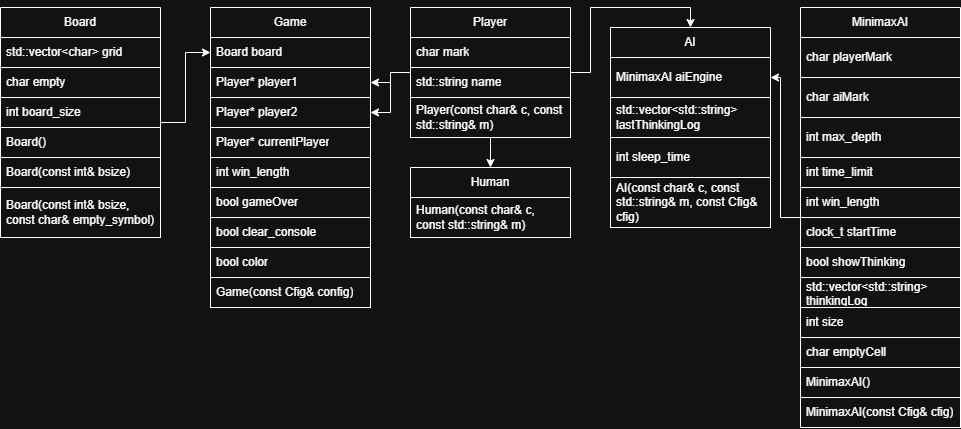
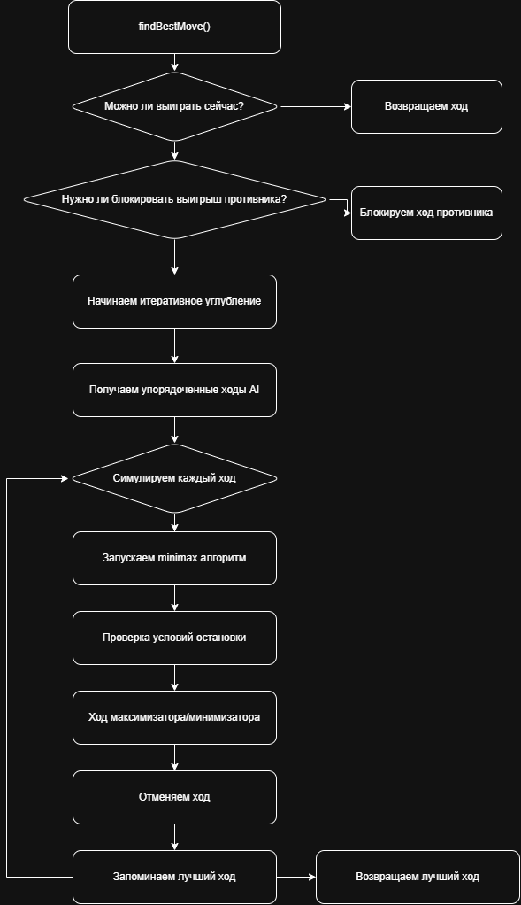

## tic-tac-toe

### Описание работы алгоритма

1. Запускаем отсчет времени
2. Проводим быстрые тактические проверки
3. Итеративное углубление
    1. устанавливаем глубину, лучший ход и лучшую оценку
    2. Прерываем цикл, если время вышло
    3. Инициализация параметров для текущей глубины
    4. получаем упорядоченные ходы
    5. симулируем ходы
    6. запускаем minimax для ответа игрока
    7. откатываем ход
    8. обновляем лучший ход




### Начало работы
1. Склонируйте проект
```bash
git clone https://github.com/groknut/tic-tac-toe.git
cd tic-tac-toe
```
2. Соберите проект
```bash
g++ -Ilibs/cfig main.cpp src/*.cpp libs/cfig/cfig.cpp -o main
```

### Пример конфигурации проекта
```ini
# параметры доски
[board]
size = 20 # размер доски
empty = '-' # пустой символ
# параметры игры
[game]
win_length = 5 # длина победы
start = 'X' # кто начинает
color = true # цветовое оформление
# параметры игроков
[player1]
type = "human" # тип игрока
name = "Groknut" # имя игрока
mark = 'X' # символ игрока

[player2]
type = "ai"
name = "AI"
mark = "O"
# параметры ИИ
[AI]
depth = 6 # глубина
time_limit = 10000 # лимит по времени в мс
show_thinking = true # показывать ли раздумья ИИ на следующем ходу
# для отладки
[debug]
sleep = 3000 # задержка для просмотра результатов
clear_console = true # очистка консоли
```
